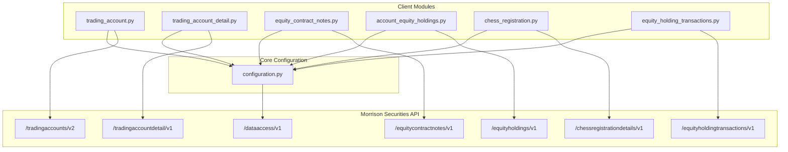
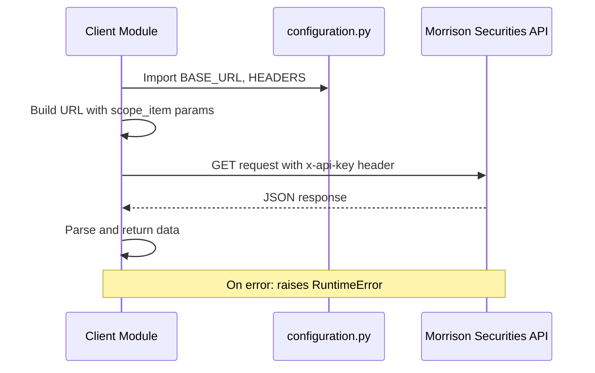
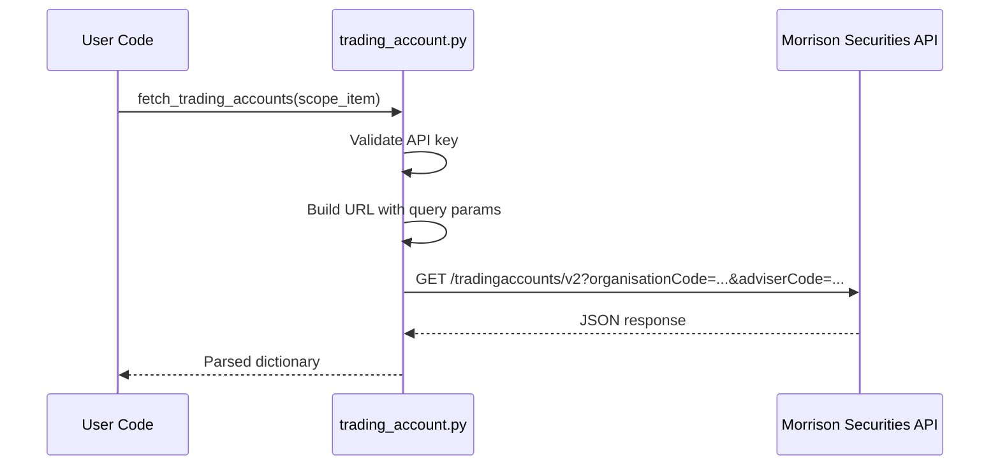
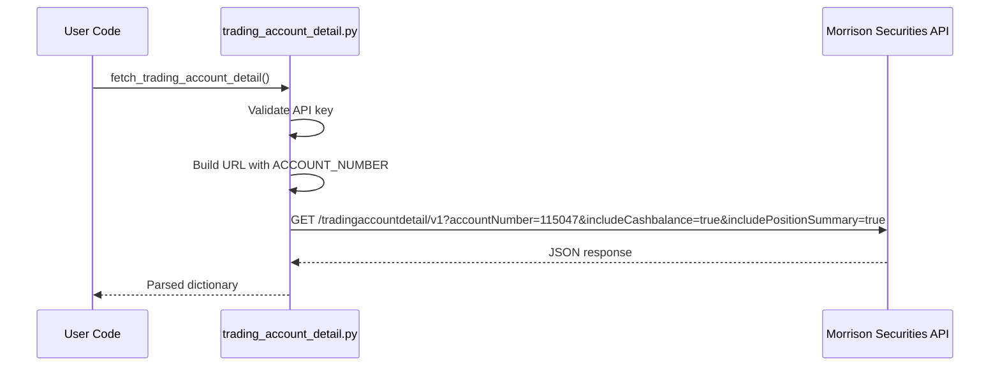
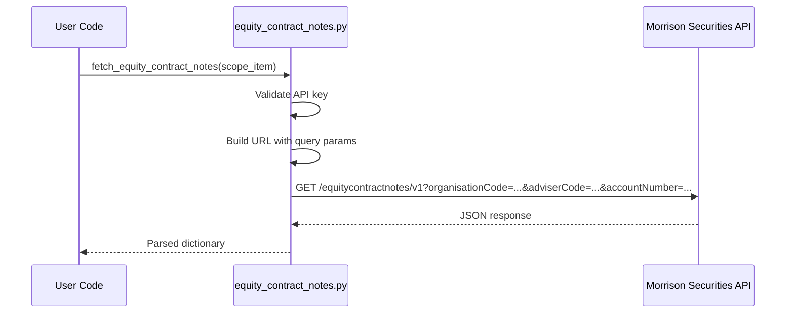
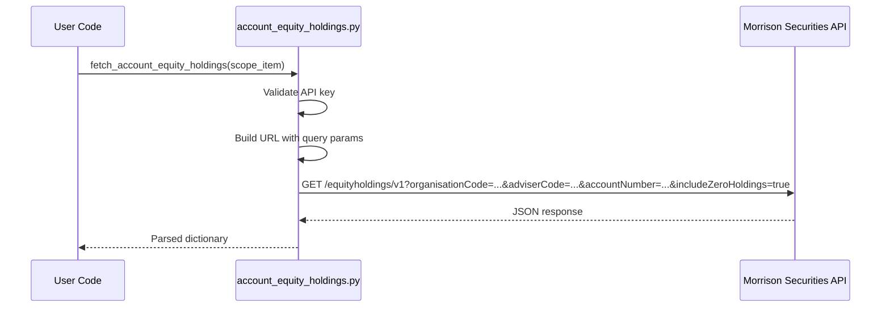
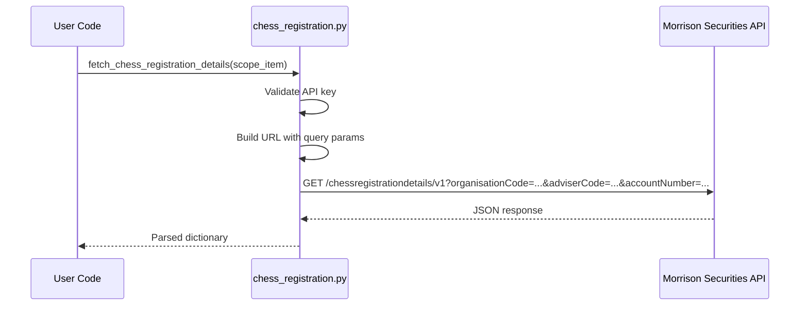
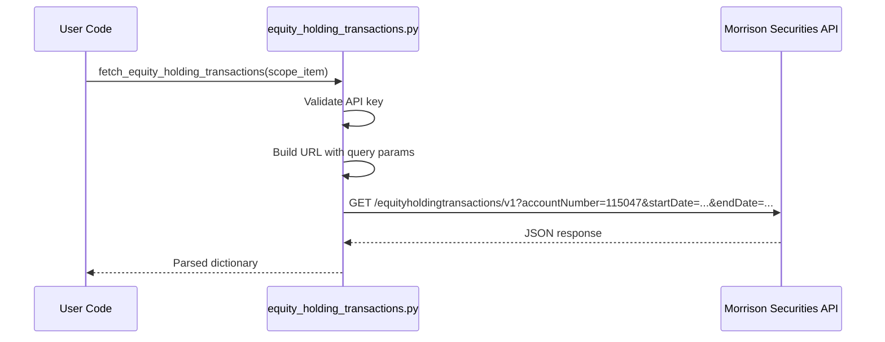
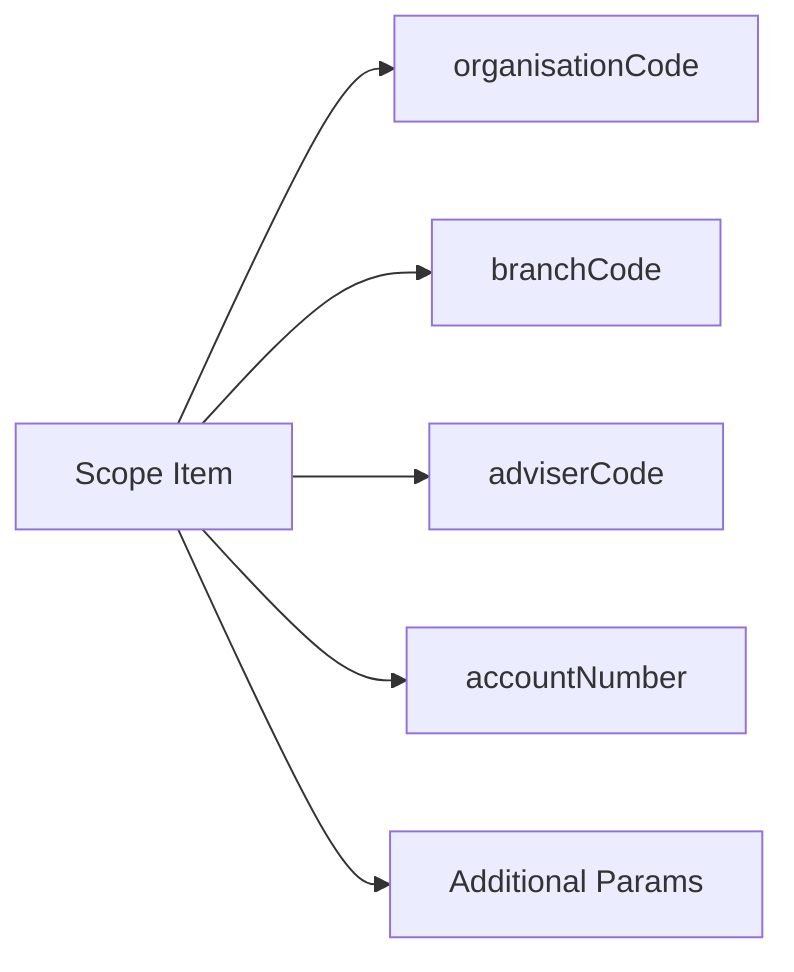

# VES Morrison Securities Data Access

Python client library for interacting with the Morrison Securities Data Access API.

## Prerequisites

- Python 3.8+
- `pip` for dependency management

## Installation

```bash
pip install -r requirements.txt
```

## Configuration

Create a `.env` file in the project root with the following variables:

```
MORRISON_API_BASE_URL=https://api.morrisonsecurities.com/backoffice
MORRISON_ACCESS_KEY=<your-api-key>
```

| Variable | Description | Default |
|----------|-------------|---------|
| `MORRISON_API_BASE_URL` | Base URL for the Morrison Securities API | `https://api.morrisonsecurities.com/backoffice` |
| `MORRISON_ACCESS_KEY` | API key issued by Morrison Securities | *(required)* |

## Architecture



## Request Flow



## Endpoints

### Base Configuration API

**Module:** `configuration.py`
**Endpoint:** `GET {BASE_URL}/dataaccess/v1`

Entry point for retrieving configuration/scoping data. Other modules use this to obtain scope items.

```python
from configuration import fetch_data

config = fetch_data()
```

---

### Trading Accounts

**Module:** `trading_account.py`
**Endpoint:** `GET {BASE_URL}/tradingaccounts/v2`

Retrieves trading accounts based on scope parameters.

#### Query Parameters

| Parameter | Type | Required | Description |
|-----------|------|----------|-------------|
| `organisationCode` | string | No | Organisation code |
| `branchCode` | string | No | Branch code |
| `adviserCode` | string | No | Adviser code |
| `accountNumber` | string | No | Account number |
| `includeInactive` | boolean | No | Include inactive accounts |

#### Usage

```python
from trading_account import fetch_trading_accounts

scope = {
    "organisationCode": "ORG001",
    "branchCode": "BR01",
    "adviserCode": "ADV01",
    "accountNumber": "115047",
    "includeInactive": False,
}

data = fetch_trading_accounts(scope)
```

#### Request Flow



---

### Trading Account Detail

**Module:** `trading_account_detail.py`
**Endpoint:** `GET {BASE_URL}/tradingaccountdetail/v1`

Retrieves detailed information for a specific trading account.

#### Query Parameters

| Parameter | Type | Required | Description |
|-----------|------|----------|-------------|
| `accountNumber` | string | Yes | Account number |
| `includeCashbalance` | boolean | Yes | Include cash balance |
| `includePositionSummary` | boolean | Yes | Include position summary |

#### Usage

```python
from trading_account_detail import fetch_trading_account_detail

data = fetch_trading_account_detail()
```

#### Request Flow



---

### Equity Contract Notes

**Module:** `equity_contract_notes.py`
**Endpoint:** `GET {BASE_URL}/equitycontractnotes/v1`

Retrieves equity contract notes for a given scope.

#### Query Parameters

| Parameter | Type | Required | Description |
|-----------|------|----------|-------------|
| `organisationCode` | string | No | Organisation code |
| `branchCode` | string | No | Branch code |
| `adviserCode` | string | No | Adviser code |
| `accountNumber` | string | No | Account number (default: `115047`) |

#### Usage

```python
from equity_contract_notes import fetch_equity_contract_notes

scope = {
    "organisationCode": "ORG001",
    "branchCode": "BR01",
    "adviserCode": "ADV01",
    "accountNumber": "115047",
}

data = fetch_equity_contract_notes(scope)
```

#### Request Flow



---

### Account Equity Holdings

**Module:** `account_equity_holdings.py`
**Endpoint:** `GET {BASE_URL}/equityholdings/v1`

Retrieves equity holdings for a given account.

#### Query Parameters

| Parameter | Type | Required | Description |
|-----------|------|----------|-------------|
| `organisationCode` | string | No | Organisation code |
| `branchCode` | string | No | Branch code |
| `adviserCode` | string | No | Adviser code |
| `accountNumber` | string | No | Account number |
| `includeZeroHoldings` | boolean | No | Include zero holdings |

#### Usage

```python
from account_equity_holdings import fetch_account_equity_holdings

scope = {
    "organisationCode": "ORG001",
    "branchCode": "BR01",
    "adviserCode": "ADV01",
    "accountNumber": "115047",
    "includeZeroHoldings": True,
}

data = fetch_account_equity_holdings(scope)
```

#### Request Flow



---

### CHESS Registration Details

**Module:** `chess_registration.py`
**Endpoint:** `GET {BASE_URL}/chessregistrationdetails/v1`

Retrieves CHESS registration details for a given scope.

#### Query Parameters

| Parameter | Type | Required | Description |
|-----------|------|----------|-------------|
| `organisationCode` | string | No | Organisation code |
| `branchCode` | string | No | Branch code |
| `adviserCode` | string | No | Adviser code |
| `accountNumber` | string | No | Account number |

#### Usage

```python
from chess_registration import fetch_chess_registration_details

scope = {
    "organisationCode": "ORG001",
    "branchCode": "BR01",
    "adviserCode": "ADV01",
    "accountNumber": "115047",
}

data = fetch_chess_registration_details(scope)
```

#### Request Flow



---

### Equity Holding Transactions

**Module:** `equity_holding_transactions.py`
**Endpoint:** `GET {BASE_URL}/equityholdingtransactions/v1`

Retrieves equity holding transactions for a given account and date range.

#### Query Parameters

| Parameter | Type | Required | Description |
|-----------|------|----------|-------------|
| `organisationCode` | string | No | Organisation code |
| `branchCode` | string | No | Branch code |
| `adviserCode` | string | No | Adviser code |
| `accountNumber` | string | Yes | Account number |
| `startDate` | string | No | Start date for transactions |
| `endDate` | string | No | End date for transactions |

#### Usage

```python
from equity_holding_transactions import fetch_equity_holding_transactions

scope = {
    "organisationCode": "ORG001",
    "branchCode": "BR01",
    "adviserCode": "ADV01",
    "accountNumber": "115047",
    "startDate": "2024-01-01",
    "endDate": "2024-12-31",
}

data = fetch_equity_holding_transactions(scope)
```

#### Request Flow



---

## Common Scope Parameters

Most endpoints accept the following optional scope parameters for filtering:



| Parameter | Description |
|-----------|-------------|
| `organisationCode` | Filters by organisation |
| `branchCode` | Filters by branch |
| `adviserCode` | Filters by adviser |
| `accountNumber` | Filters by account number |

## Error Handling

All API functions raise `RuntimeError` when:

- `MORRISON_ACCESS_KEY` is missing
- The API returns an empty response
- The response body is not valid JSON
- The server returns an HTTP error

## Project Structure

```
├── configuration.py                     # Base configuration and fetch_data()
├── trading_account.py                   # Trading Accounts API client
├── trading_account_detail.py            # Trading Account Detail API client
├── equity_contract_notes.py             # Equity Contract Notes API client
├── account_equity_holdings.py           # Account Equity Holdings API client
├── chess_registration.py                # CHESS Registration API client
├── equity_holding_transactions.py       # Equity Holding Transactions API client
├── requirements.txt                     # Python dependencies
├── .env                                 # Environment variables (git-ignored)
├── .gitignore                           # Git ignore rules
└── README.md                            # Project documentation
```

## License

See [LICENSE](LICENSE) for details.
